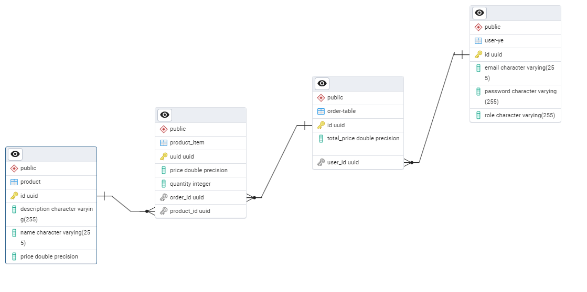

# store-management-tool

## Table dependencies

## Order controller endpoints
### Get all orders present in the database - getAllOrders()
- **Endpoint:** `GET /api/order/all`
- **Roles:** Restricted access

### Get orders that belong to a specific user by their email - getOrderByEmail(@PathVariable String email)
- **Endpoint:** `GET /api/order/get/{email}`
- **Roles:** Public access

## Product controller endpoints
### Add a new product to the database - addProduct(@RequestBody AddProductDTO addProductDTO)
- **Endpoint:** `POST /api/product/add`
- **Roles:** Restricted access

### Add multiple products to the database - addProducts(@RequestBody List<AddProductDTO> addProductDtoToProductList)
- **Endpoint:** `POST /api/product/add`
- **Roles:** Restricted access

### Get all products available in the database - getAllProduct()
- **Endpoint:** `GET /api/product/get/all`
- **Roles:** Public access

### Get a product by its id - getProductById(@PathVariable String id)
- **Endpoint:** `GET /api/product/get/{id}`
- **Roles:** Public access

### Change the price of a product identified by id - changePriceOfProduct(@PathVariable String id, @RequestBody String price)
- **Endpoint:** `PATCH /api/product/price/{id}`
- **Description:** Changes the price of a product and updates the shopping carts in which it is present. 
- **Roles:** Restricted access

### Delete product by id - deleteProductById(@PathVariable String id)
- **Endpoint:** `DELETE /api/product/delete/{id}`
- **Description:** Deletes the product from database and from the orders in which is present. Updates prices.
- **Roles:** Restricted access

### Add a product to an order - addToOrder(@PathVariable String id, @RequestBody AddProductToOrderDTO addProductToOrderDTO)
- **Endpoint:** `GET /api/product/get/{id}`
- **Description:** Creates a new order if the user doesn't have one active. If an order exists, it updates the quantities and the price.
- **Roles:** Public access

### Delete a product from an order - deleteProductFromOrder(@PathVariable String orderId, @PathVariable String productId)
- **Endpoint:** `DELETE /api/product/deleteFromOrder/{orderId}/{productId}}`
- **Description:** Deleting a product from an order found by its id 
- **Roles:** Public access

## Product Item Controller (unit of order)
### Get all items in the database - getItems()
- **Endpoint:** `GET /api/item/all`
- **Roles:** Restricted access

## User Controller
### Register user based on email and password - register(@RequestBody RegisterUserDTO registerUserDTO)
- **Endpoint:** `POST /api/auth/register`
- **Roles:** Public access

### Login user based on email and password - login(@RequestBody LoginUserDTO loginUserDTO)
- **Endpoint:** `POST /api/auth/register`
- **Roles:** Public access

### Get all users from database - getUsers()
- **Endpoint:** `GET /api/auth/users`
- **Roles:** Restricted access

### Verify that the token of user is valid - getIsTokenValid(@PathVariable String token, @RequestBody LoginUserDTO loginUserDTO)
- **Endpoint:** `GET /api/auth/token/valid/{token}`
- **Roles:** Public access